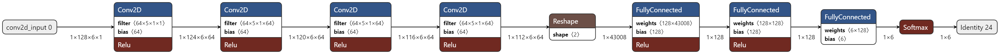
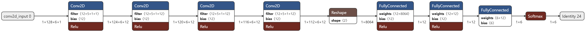
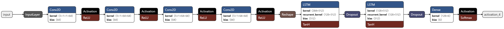

# Remote Inference for Microcontrollers at the Edge
Jingtao Leo Zhang

ECE202A Fall 2021

# Table of Contents
* Abstract
* [Introduction](#1-introduction)
* [Related Work](#2-related-work)
* [Technical Approach](#3-technical-approach)
* [Evaluation and Results](#4-evaluation-and-results)
* [Discussion and Conclusions](#5-discussion-and-conclusions)
* [References](#6-references)

# Abstract
<!-- Provide a brief overview of the project objectives, approach, and results. -->

The goal of this project is to investigate the performance of using edge servers to provide deep neural network inference on data gathered by embedded microcontrollers. Three setups for providing neural net inferences to an Arduino are tested. One using just the Arduino, one using the Arduino and a Coral Dev Board, and one using the Arduino and a PC. Data processing and neural net inference times are reduced significantly when offloading however the communication overhead makes these benefits negligible.

# 1. Introduction
<!-- 
This section should cover the following items:
* Motivation & Objective: What are you trying to do and why? (plain English without jargon)
* State of the Art & Its Limitations: How is it done today, and what are the limits of current practice?
* Novelty & Rationale: What is new in your approach and why do you think it will be successful?
* Potential Impact: If the project is successful, what difference will it make, both technically and broadly?
* Challenges: What are the challenges and risks?
* Requirements for Success: What skills and resources are necessary to perform the project?
* Metrics of Success: What are metrics by which you would check for success? 
* -->

The goal of this project is to evaluate the effectiveness of using a networked CNN accelerator to improve the performance of deep neural networks when using data gathered by embedded microcontrollers.

Running ML models on embedded devices is known as TinyML and has shown validity [[1](#1)]. However, resource constraints limit the possibilities to traditional ML methods such as SVM, and MLP or relatively shallow neural networks. If the microcontroller is capable of wireless communication, data can be sent from the device to an edge server or IoT hub. The the edge server can make inferences using a more complicated model or processes data and send it to a core cloud for inference [[2](#2)]. In the second scenario, the data has to go from the embedded device to the edge server, through the internet to the core cloud, then back to the edge cloud, then back to the IoT device, adding a lot of latency. 

Computing inference remotely is not a novel concept and is quite common, however the setups used in current research papers involve GPU equipped PCs as edge servers and smartphones as devices [[3](#3)]. The system that will be evaluated in this project consists of the Arduino Nano 33 BLE Sense for the device, and the Coral Dev Board for the server. The Arduino is a microcontroller class embedded device and the Coral is a single board computer equipped with an edge tensor processing unit. The overall concept for this approach is fairly proven, however this project takes component cost much lower.

The communication between device and server will be through Bluetooth low energy which is not known for its throughput and can take a significant portion of the runtime of an iteration. For success, the project requires basic knowledge of training and running neural networks. There will be a small model that can run on the device and a more complex one that will run on the edge server. A preexisting network architecture and dataset will be used.

The overall time between when the data is finished being collected and when an inference is available will be the most important metric. This metric will consist of data processing time, communication overhead if an edge server is used, and the inference time for the neural network.

# 2. Related Work

## Neural Networks on Microcontrollers.
Giving neural net inference capabilities to microcontrollers is an emerging area of research [[1](#1)]. Applications exist from recognizing wakeup voice commands (like for Google home and Amazon Alexa) or detecting when someone is looking at a camera to activate a larger processor for facial recognition [[9](#9)]. These networks are typically 10s of kilobytes in size. This project will involve neural network computation on a microcontroller.

## Remote Inference.
Using powerful networked devices to run inference is very widespread in machine learning applications [[10](#10)]. Using edge servers for inference rather than going through the internet is an area of interest due to latency and security concerns and there has been a lot of work in that area [[3](#3)], however the publications use smartphones for data collection and GPU eqipped PCs for the edge server. In other cases the edge server is primarly for data preprocessing and the actual inference is run on a core cloud [[4](#4)].

# 3. Technical Approach

## Hardware
There will be three setups that will run inference. 

The first setup only uses the Arduino Nano 33 BLE Sense which has an Arm Cortex-M4 processor. The Arduino will capture data from its inertial measurement unit, process it, then use run inference using a small CNN. 

The second setup will use the Arduino for data gathering and a Coral Dev Board edge server for data processing and inference. The Coral is equipped with an Arm Cortex A53-processor and edge TPU accelerator. The communication between the Coral and Arduino will be through BLE. The server will run inference using a larger model. The second setup is pictured below.

The third setup will be similar to the second one, however the Coral will be replaced by a PC with an Nvidia GTX 1060 GPU and Intel i7-8750H CPU. 
 
## Software
The application that will be used to compare the setups is human activity recognition using accelerometer and gyroscope data.

### Data
The dataset that the neural networks are trained on is the UCI Smartphone-Based Recognition of Human Activities and Postural Transitions Data Set [[8](#8)]. The input to a model is a 768 length floating point vector of sets of 3 axis accelerometer and 3 axis gyroscope measurements sampled at 50 Hz. The time for the entire vector to be generated is 2.56 seconds.

The data is essentially 6 vectors of IMU measurements. Each of these vectors is median filtered, then filtered by a third degree low-pass butterworth filter with cutoff at to 20Hz to remove noise and gravity components from the accelerometer. The vectors are then assembled into the final 768 size vector.

Median filter implementation is by Bogdan Anderu[[11](#11)]. Butterworth filter implementation is based on Darien Pardina's filter implementation [[12](#12)].

### Models
The model that will run on the Coral board is the baseline CNN used in [[5](#5)] that has been quantized for compatibility with the edge TPU. Its architecture is shown below. The model runs using TFlite for edge TPU.

The model that will run on the Arduino is similar to the one that runs on the Coral however the number of filters in its convolutional layers and number units in its densely connected layers have been reduced. Its architecture is shown below. The model runs using TFlite for microcontrollers.

The model that will run on the PC is the DeepConvLSTM from [[5](#5)] and its architecture is shown below. The model runs on standard TensorFlow with a GPU.

Model implementations are based on Takumi Watanabe's work [[6](#6)].

### Communication

Data is sent to the edge server for inference through Bluetooth low energy version 4.2. The maximum packet size is 512 bytes meaning the input vector of 768 floats must be sent in 6 slices. This is done by the following protocol. The communication happens using two BLE characteristics, TX and RX (from the perspective of the device). 

When the data is ready, the device will continuously send the first slice of 128 floats on the TX characteristic until it reads an acknowledgement on RX from the edge server. After that it will go to the next slice and again wait for an acknowledgement, this repeats until all 6 slices are sent after which the device will wait for an inference on RX. When it receives the inference it will sample and process a new vector of inputs and repeat the process. It will only repeat the first slice on the first iteration before an acknowledgement is received. 

### Runtime Process

For the setup that involves only the Arduino. The IMU sampled for the required 2.56 seconds, the median and butterworth filters are applied, then the vector is sent to inference.

For the setups that involve an edge server, the IMU is sampled, the raw data is sent to the edge server where it is processed and an inference is made. The classification is then sent back to the device. The edge servers use python.

# 4. Evaluation and Results

## Metrics
The time it takes to sample the data is always 2.56 seconds, as the dataset specifies. 

The setup with just the microcontroller has only data processing and inference times to profile. The setups involving edge servers have communications, processing, and inference times to consider.

The results averaged over 100 iterations are tabulated below. Times are in seconds. In parentheses is the speedup over the Arduino only setup.

| Setup           | Model Size | Accuracy* | Processing      | Communication | Inference          | Total              |
| --------------- | ---------- | --------- | --------------- | ------------- | ------------------ | ------------------ |
| Arduino         | 364 kB     | 74.7%     | 0.05090         | N/A           | 1.20305            | 3.80777            |
| Arduino + Coral | 1364 kB    | 92.1%     | 0.01258 (4.05x) | 2.92701**     | 0.01843   (66.76x) | 5.51802** (-1.45x) |
| Arduino + PC    | 1785 kB    | 98.7%     | 0.00312 (16.3x) | 2.92701       | 0.01428  (84.25x)  | 5.50441 (-1.45x)   |

\* For some reason, the actual test accuracy on the dataset is about 95% for all three of these models. This may be due to how the dataset was split. However, during real world tests of the whole system there is a clear discrepancy between the smaller and larger models. I decided to use the final epoch training accuracy as an indicator of the effectiveness of a model architecture because they seem in line with what one woudl expect from the size of each model. The actual accuracy of neural net architectures for human activity recognition is beyond the scope of this project.

\*\* Unfortunately, during development I damaged the Bluetooth chip on the Coral board by static electricity discharge. I believe this is the case because Bluetooth had previously functioned on it then stopped with no changes to code, also bluetooth devices can no longer be found when from Linux commands. I will assume the communication penalty from the Arduino + PC setup for both remote inference setups.

# 5. Discussion and Conclusions

## Results Analysis
For the Arduino only setup, data processing took 1.3% of the iteration time, the fixed sampling period took 67.2%, and the inference took 31.6%.

For the setups including the Coral and PC servers, data processing and inference took less than 1% of the iteration time while the fixed sampling time took 46.4% and 46.% of the iteration and communication took 53.0% and 53.2% respectively.

The communication penalty is large considerable and takes up most of the iteration time. The input vector to the model consists of 768 floating point numbers for a total of 3072 bytes. With a communication cost of 2.92701 seconds, this gives an approximate bitrate of the BLE setup of 1.05kB/s.

The time to process the data (median and butterworth filter) is lowered drastically by performing it on the powerful CPUs of the edge servers, however the absolute time saved is negligible considering the communication penalty.

One oddity is that the accuracies for these models on the dataset are quite similar at around 95%; however, the accuracy of neural network architectures for human activity recognition is beyond the scope of this project. The Coral board and PC were capable of running significantly larger models than the ones selected for this application. In a different benchmark application the accuracy benefit could be very significant.

## Future Directions.

### Parallelism
The Arduino uses an Arm Cortex M4 based chip which is single core and single thread. The existence of a remote server gives parallel computation capabilities. The next iteration's data collection runs concurrently with the inference processing. If the communication overhead was lower and inference times were longer the throughput of the system could see benefit from edge server inference.

### Compressed Sensing
This application had large communication overheads due to the large size of input vector. This vector is a sampled signal which gives the possibility of reduction in data size by using compressed sensing [[7](#7)]. This reduction in data size comes at the cost of requiring information about the signal sparsity beforehand and increased computation to recover the original signal. The increased computation cost would be offset by the increased processing power of the edge server.

### Model Partitioning
It is possible to partition models to allow different sections to run on different platforms. This provides an opportunity to decrease communication costs. For example, the AlexNet [[13](#13)] image classification architecture has an input dimension of 150,528, however at an intermediate layer, the output size is 64,896. If the model was partitioned here, then the amount of data that would need to be send would decrease substantially. However, the preprocessing of input data would no longer be able to occur at the edge server.

### Aggresssive Quantization
Quantization is a method for reducing the computational cost of a neural network by reducing the size and therefore precision of the datatypes used for weights. It has been shown that reduction up to 4 bit integers is possible with minimal loss in accuracy [[14](#14)] and even architectures using a single bit [[15](#15)] are an area of research. This again gives potential for reduction in communication costs. Quantization would also allow deeper models to be run on embedded microcontrollers.

### Bluetooth Refinement
The theoretical throughput of Bluetooth Low Energy 4.2 is 784kB/s [[16](#16)] and practical throughputs up to 120kB/s [[17](#17)]. The BLE communication implemented in this project was done using the ArduinoBLE library and the protocol is likely suboptimal. A more advanced BLE communication implementation could decrease the commnication penalty substantially. For example, at 120kB/s, the penalty would be .0256s which would make remote processing and inference very useful. A possible optimization is using 6 transmit characteristics and sending all 6 slices without waiting for acknowledgements instead of one by one using a single charactheristic.

# 6. References

<a id="1">[1]</a>: R. Sanchez-Iborra and A. F. Skarmeta, "TinyML-Enabled Frugal Smart Objects: Challenges and Opportunities," in IEEE Circuits and Systems Magazine, vol. 20, no. 3, pp. 4-18, thirdquarter 2020, doi: 10.1109/MCAS.2020.3005467. https://ieeexplore.ieee.org/document/9166461

<a id="2">[2]</a>:  M. Shamim Hossain, Ghulam Muhammad, Emotion recognition using secure edge and cloud computing, Information Sciences, Volume 504, 2019, Pages 589-601, ISSN 0020-0255, https://doi.org/10.1016/j.ins.2019.07.040.

<a id="3">[3]</a>: J. Chen and X. Ran, "Deep Learning With Edge Computing: A Review," in Proceedings of the IEEE, vol. 107, no. 8, pp. 1655-1674, Aug. 2019, doi: 10.1109/JPROC.2019.2921977. https://ieeexplore.ieee.org/document/8763885

<a id="4">[4]</a>: M. G. Sarwar Murshed, Christopher Murphy, Daqing Hou, Nazar Khan, Ganesh Ananthanarayanan, and Faraz Hussain. 2021. Machine Learning at the Network Edge: A Survey. ACM Comput. Surv. 54, 8, Article 170 (November 2022), 37 pages. DOI:https://doi.org/10.1145/3469029

<a id="5">[5]</a>: Ordóñez, F.J.; Roggen, D. Deep Convolutional and LSTM Recurrent Neural Networks for Multimodal Wearable Activity Recognition. Sensors 2016, 16, 115. https://doi.org/10.3390/s16010115

<a id="6">[6]</a>: Watanabe, Takumi, Deep Learning for Human Activity Recognition, (2020), GitHub repository, https://github.com/takumiw/Deep-Learning-for-Human-Activity-Recognition

<a id="7">[7]</a>: D. L. Donoho, "Compressed sensing," in IEEE Transactions on Information Theory, vol. 52, no. 4, pp. 1289-1306, April 2006, doi: 10.1109/TIT.2006.871582.

<a id="8">[8]</a>: Smartphone-Based Recognition of Human Activities and Postural Transitions Data Set. 2015. Available online: http://archive.ics.uci.edu/ml/datasets/Smartphone-Based+Recognition+of+Human+Activities+and+Postural+Transitions

<a id="9">[9]</a>: Warden, Pete, and Daniel Situnayake. TinyML. O'Reilly Media, Incorporated, 2019.

<a id="10">[10]</a>: Kaur, Harkiran, Top Cloud Computing Platforms for Machine Learning, (2020), Webpage, https://www.geeksforgeeks.org/top-cloud-computing-platforms-for-machine-learning/

<a id="11">[11]</a>: Bogdan, Alexandru, Median Filter, (2019), GitHub repository, https://github.com/accabog/MedianFilter

<a id="12">[12]</a>: Pardians, Darien, C++ Implementation of MATLAB's filtfilt , Webpage, https://stackoverflow.com/a/27270420

<a id="13">[13]</a>: Alex Krizhevsky, Ilya Sutskever, and Geoffrey E. Hinton. 2017. ImageNet classification with deep convolutional neural networks. <i>Commun. ACM</i> 60, 6 (June 2017), 84–90. DOI:https://doi.org/10.1145/3065386

<a id="14">[14]</a>: Zhao, Junhe, et al. "Towards Compact 1-bit CNNs via Bayesian Learning." International Journal of Computer Vision (2021): 1-25.

<a id="15">[15]</a>: Choukroun, Yoni, et al. "Low-bit Quantization of Neural Networks for Efficient Inference." ICCV Workshops. 2019.

<a id="16">[16]</a>: Gupta, Sachin, BLE v4.2: Creating Faster, More Secure, Power-Efficient Designs—Part 1, (2016), Webpage, https://www.electronicdesign.com/technologies/communications/article/21801788/ble-v42-creating-faster-more-secure-powerefficient-designspart-1

<a id="17">[17]</a>: Bulić, Patricio et al. “Data Transmission Efficiency in Bluetooth Low Energy Versions.” Sensors (Basel, Switzerland) vol. 19,17 3746. 29 Aug. 2019, doi:10.3390/s19173746